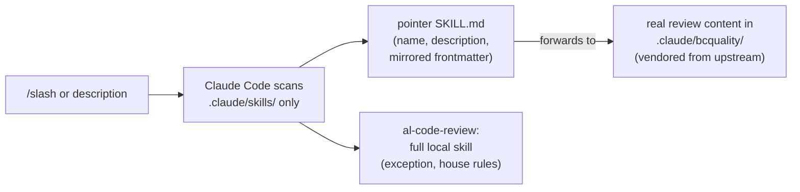
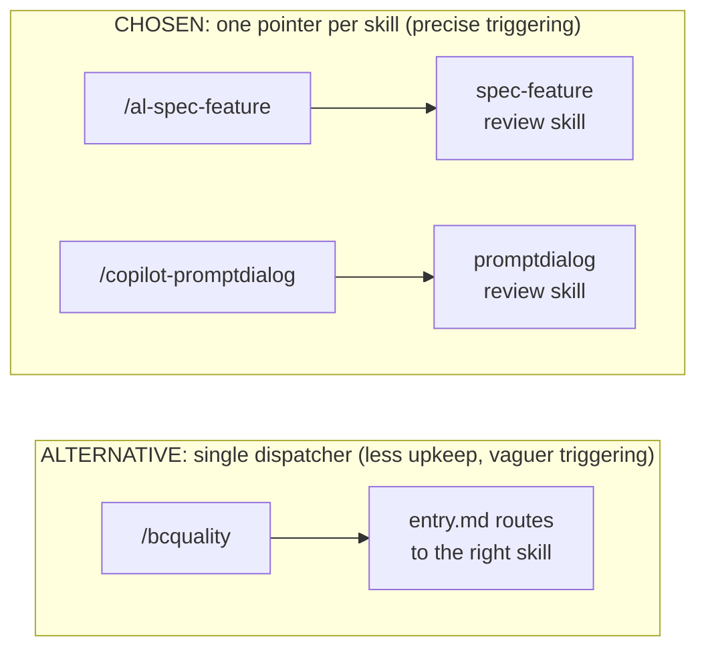

# Community Integration for Business Central

A community-maintained Business Central integration repository, built on
[AL-Go for GitHub](https://github.com/microsoft/AL-Go) and packaged with a
curated set of AI development tools for AL. Use it as a template: fork it, point
it at your own solution, and drive development through the Spec-Driven workflow.

## What is in here

- **AL-Go pipelines** (`.github/workflows/`, `.AL-Go/`): build, test, and release Business Central apps.
- **AI agents** (`.claude/agents/`): focused reviewers and verifiers for AL code (readability, test coverage, performance, multitenancy, AppSource, and more).
- **Skills** (`.claude/skills/`): review and validation skills, invocable as `/slash` commands. All but `al-code-review` are thin pointers to the matching BCQuality skill.
- **BCQuality rules** (`.claude/bcquality/`): a vendored, Microsoft-authored subset of the [BCQuality](https://github.com/EquerraNZ/community-BCQuality) knowledge corpus that agents cite when reporting findings.
- **Spec-Driven Development** (`specs/`): the project constitution and per-feature specs. The full contract for every agent is [AGENTS.md](AGENTS.md).

## How the pieces fit together

Three layers, each with one job:

- **Knowledge** (`.claude/bcquality/`): vetted rules, the single source of truth, vendored from upstream [EquerraNZ/community-BCQuality](https://github.com/EquerraNZ/community-BCQuality). Answers "what is true".
- **Skills** (`.claude/skills/`): reusable review rubrics. Answers "what to check".
- **Agents** (`.claude/agents/`): reviewer personas with grading and a JSON output contract. Answers "who runs, with what judgement, producing what verdict". Agents load skills and cite knowledge by path.

**Why skills are thin pointers.** Claude Code only discovers skills under
`.claude/skills/<name>/SKILL.md`, never under `.claude/bcquality/`. Each pointer
carries the `name`/`description` the runtime needs plus the upstream frontmatter
it mirrors, then forwards to the real file in BCQuality. Edit upstream and
re-vendor, never the pointer. `al-code-review` is the one exception: it stays a
full local skill because it carries this repo's house rules.

**Why one pointer per skill, not one dispatcher.** Per-skill pointers give
precise triggering and real `/slash` commands, at the cost of light maintenance
when upstream changes. A single dispatcher skill would remove that upkeep but
lose specific triggering. This repo favours discoverability. The review agents
reach BCQuality directly through its `entry.md` dispatch model; the pointers are
only the human-invocable surface.

## Spec-Driven Development

The spec is the brain, the agent is the muscle. No production AL is written until
an approved spec exists. At each stage you draft the artifact, with the agent's
help, then run the matching skill as a review gate. These skills review, they do
not author:

1. `/al-spec-init`: reviews the constitution (`brief.md`, `tech-design.md`, `roadmap.md`). Once per project.
2. `/al-spec-feature`: reviews a feature's `spec.md` against the constitution and checks the acceptance criteria are testable.
3. `/al-plan-feature`: reviews `plan.md` and `tasks.md` against the approved spec.
4. `/al-implement-feature`: reviews the implementation against its spec, plan, and tasks, then the verifier agents and a BCQuality review run.

See [AGENTS.md](AGENTS.md) for the full contract and [specs/README.md](specs/README.md) for the layout.

## Getting started

1. Open `al.code-workspace` in VS Code.
2. In a Claude session, describe what you want to build and the business case. The agent follows the SDD loop from [AGENTS.md](AGENTS.md): it drafts the constitution, spec, plan, and code, runs the matching review gate at each stage (`/al-spec-init`, `/al-spec-feature`, `/al-plan-feature`, `/al-implement-feature`), and pauses for your approval between stages.
3. Build and release through the standard AL-Go workflows. See [aka.ms/AL-Go](https://aka.ms/AL-Go).

## Running the tools

All three entry points need the [Claude Code CLI](https://claude.com/claude-code) installed and on your PATH.

- **VS Code tasks:** open the workspace, then Terminal > Run Task. `AI: SDD: ...` for the review gates, `AI: Run agent...` for a single verifier, `AI: Playlist: ...` for the preset sets. Tasks appear only when the workspace file is open.
- **Slash commands:** type `/al-spec-init`, `/al-spec-feature`, `/al-plan-feature`, or `/al-implement-feature`, or just describe the task and let the matching skill or agent trigger.
- **Automatic:** after an AL build or compile, the post-build hook reminds the agent to run the mandatory verifier set and a BCQuality review.

## Contributing

Open an issue to discuss a change, then send a pull request. Keep agent and skill
files self-contained and free of organisation-specific references so the content
stays reusable across the community.

## License

MIT, see [LICENSE](LICENSE). The vendored BCQuality content is separately
MIT-licensed by Microsoft Corporation, with its license under `.claude/bcquality/`.
